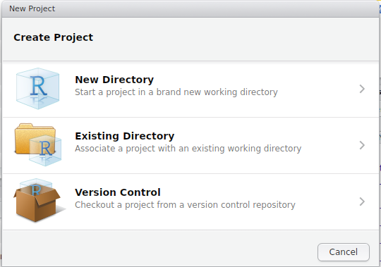

```{r setup, include=FALSE}
knitr::opts_chunk$set(echo = FALSE, include = FALSE, 
                      warning = FALSE, message = FALSE, 
                      out.width = 800, fig.align = "center")
```

```{r, loadPackages}
library(knitr)
```


## Why use R?

- The main software/language used for analysis of biological data (along with Python)
- Can handle extremely large datasets  
- We can easily perform complex analytic procedures
- Many processes come as inbuilt functions  
- Huge user base of biological researchers

## Why use R? | Other Key Reasons

- Avoids common Excel pitfalls
- Reproducible Research

## Automatic Conversion | A common Excel problem

Excel is notorious for converting values from one thing to another inappropriately.

- Gene names are often converted to dates 
    - Septin genes (e.g. _SEPT9_)

- Genotypes can be converted into numeric values
    - A homozygote for the first allele (1/1)
    
In `R` we generally work with plain text files.
    
## Reproducible Research

- Research is littered with mistakes from Excel
- Studies have made Phase III trials
- _We have code to record and exactly repeat our analysis_
- We can find and correct errors more easily than if they are copy/paste errors

## Using R

>__With power comes great responsibility - Uncle Ben__
  
With this extra capability, we need to understand a little about:  

- Data Types  
- Data Structures  

Today we will start with:

- An Introduction to RStudio
- Reading data into R
- Manipulating and cleaning data
- Visualising data

# Introduction to RStudio

## RStudio

1. Open `RStudio` then
2. `File` > `New File` > `R Script`  
3. Save As `Introduction.R`

## RStudio

```{r, include=TRUE}
include_graphics("images/RStudio.png")
```


## The Script Window

- This is just a text editor.
- We enter our commands here but they are not executed
    - We can keep a record of __everything__ we've done
    - We can also add comments to our code
    - Comments start with the `#` symbol
    
## The Script Window

```{r, include=TRUE}
include_graphics("images/RStudio.png")
```

## The Console

- Where we execute commands
- Is essentially the _"engine"_
- We can execute commands directly in the `Console` or send from the `Script Window`

## Executing Commands from the Script Window

- Commands are sent to the `Console` by selecting a line/section, then either
    - `Ctrl + Enter`
    - Copy & Paste into the Console
    - Clicking the `Run` button at the top right of the `Script Window`
    
__Let's create an R object called `x`__

## Executing Commands from the Script Window

Enter the following in the `Script Window`, then send it to the `Console`

```{r, echo=TRUE, include=TRUE}
# Let's create our first R object
x <- 5
```

__NB: `R` is case-sensitive so please be careful__


## Executing Commands from the Script Window

We can view the contents of the object `x` by:

- entering it's name directly in the `Console`, or 
- entering it's name in the `Script Window` & sending it to the `Console`

```{r, echo=TRUE, include=TRUE, results='asis'}
x
```

We may sometimes see this written as `print(x)`

## The R Environment

Where have we created the object `x`?

- Is it on your hard drive somewhere?
- Is it in a file somewhere?

## The R Environment

We have placed `x` in our `R Workspace`

More formally known as your `Global Environment`

```{r, include=TRUE, out.width=600}
include_graphics("images/EnvironmentTab.png")
```

## The R Environment

- The `Environment` is like your desktop
- We keep all our relevant objects here and can save the entire workspace as an `.RData` object

```{r, eval=FALSE, echo=TRUE, include=TRUE}
save.image()
```


## The R Environment

- In the R Environment, we can create objects of multiple types.
- We first give them a name (e.g. `x`) and then assign a value to it using the `<-`symbol.
- __This is like an arrow putting the value into the object.__
- Can also work the other way, but is rarely done

```{r, echo=TRUE, include=TRUE}
# Using the reverse assignment operator
5 -> x
```

## RStudio | Other Tabs and Features

- Next to the `Environment` Tab is the `History` Tab
    - Contains everything executed in the `Console`
    - Useful for when we've been lazy
- Best coding practice is still to enter code in the `Script Window` and execute

## RStudio | Other Tabs and Features

In the bottom right are a series of tabs

1. `Files`: This shows your current working directory
2. `Plots`: Every time you make a graph it appears here
3. `Packages`: __NEVER CLICK OR UN-CLICK ANYTHING HERE__
4. `Help`: We'll explore this later

- Every tab can be resized using the buttons in the top right
- Window separators can also be be moved

## RStudio | Cheatsheet and Shortcuts

`Help > Cheatsheets > RStudio IDE Cheat Sheet`

Page 2 has lots of hints:

- `Ctrl + 1` places focus on the Script Window
- `Ctrl + 2` places focus on the Console
- `Ctrl + 3` places focus on the Help Tab

## Introducing Projects

- Projects help keep an analysis organised
- Very useful for managing multiple analyses
- Integrated with `Git` and `SVN` version control
- Always goes back to "where-you-were-last-time"

## Introducing Projects

Let's set one up for this course: `File > New Project`

```{r, include=TRUE, out.width=540}

```

## Introducing Projects

- Choose either a `New` or `Existing` Directory
- Navigate to where you think is suitable for keeping the course notes
- The Project will automatically be assigned the directory name