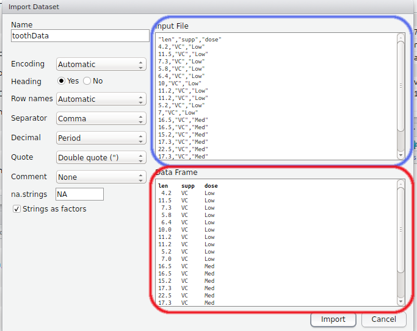

```{r setup, include=FALSE}
knitr::opts_chunk$set(echo = FALSE, include = FALSE, 
                      warning = FALSE, message = FALSE, 
                      out.width = 800, fig.align = "center")
```

```{r, loadPackages}
library(knitr)
```

# Getting Data Into R

## Importing Data

- A stumbling block for many learning `R` is the `Error Messages`
- We often see them while we're loading data
- `R` is very strict about data formats
- We can load `.xlsx`, `xls`, `csv`, `txt`, `gtf/gff` files + many more
- The structure of the spreadsheet is vital

## Importing Data

- Things we do to make it "look nice" in Excel can create problems
- In `Day1/data`, open `Real time sheep.xlsx` in Excel (or Libre Office)

__Which sheet do you thin will be the most problematic to load?__

Worksheet downloaded from Gaurav Nagar, Indian Veterinary Research Institute

## Importing Data

### Sheet 1

- This is actually the type of format `R` loves to see
- We have a simple column structure, with column and row names
- No blank rows at the top or separating sub-tables
- No blank columns

### Sheet 2
__What about all those missing values?__

## Importing Data

### Sheet 2
__What about all those missing values?__

- `R` can happily deal with missing values: $\implies$ will load as `NA`
- The missing column names may give a warning message
- Otherwise no problems

## Importing Data

### Sheet 3

- Here we effectively have 2 tables on the same sheet
    - This can cause error messages
- The plot will simply be ignored

__Always think in terms of columns__

## Using the GUI To Load Data

- In today's `data` folder is the file `toothData.csv`
- Clicking on it will only open it in the `Script Window` as a text file
- We can use the button as shown


<br> A preview will then appear

## Using the GUI To Load Data

```{r, include=TRUE, out.width=600}

```

## Using the GUI To Load Data

1. Try changing a few settings to see the changes in the Preview section
2. Once you're happy, click "Import"

Two things have just happened, and you can see two lines of code in the Console

```{r, eval=FALSE, echo=TRUE, include=TRUE}
toothData <- read.csv("RAdelaideWorkshop/Day_1/data/toothData.csv")
View(toothData)
```

## Using the GUI To Load Data

- If doing this, __ALWAYS__ copy the first line into your script!  
(This is what we've just done as a line of `R` code)

```{r, eval=FALSE, echo=TRUE, include=TRUE}
toothData <- read.csv("RAdelaideWorkshop/Day_1/data/toothData.csv")
View(toothData)
```

- The second line has opened a preview of our `R` object
- Unless we change it, the `R` object will be the filename before the `.csv`
- Also look at the `toothData` object in the `Environment` tab (click the arrow)

## Factors

- By default `R` assumes that a column of text is a categorical variable (i.e. a `factor`)
- Can be a trap for the unwary
- We can change this by unchecking the `stringsAsFactors` button during import

## What have we really done?

- In the above we called the `R` function `read.csv()` 
- From the `utils` package which is one of the `base` packages
- The help page isn't very helpful here...

```{r, echo=TRUE, include=TRUE}
?read.csv
```

- There are three basic functions listed here:  
`read.table()`, `read.csv()` and `read.delim()`
- The main differences are in the separators

## A Better Alternative


