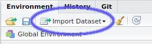

# Data Import In R
Steve Pederson  
20 July 2016  


# Getting Data Into R

## Importing Data

- A stumbling block for many learning `R` is the __Error Messages__
- We often see them while we're loading data
- `R` is very strict about data formats
- We can load `.xlsx`, `xls`, `csv`, `txt`, `gtf/gff` files + many more
- The structure of the spreadsheet is vital

## Importing Data

- Things we do to make it "look nice" in Excel can create problems
- In `Day1/data`, open `RealTimeData.xlsx` in Excel (or Libre Office)

__Which sheet do you think will be the most problematic to load?__

<div class="footer" style="font-size:55%;width:50%;line-spacing:1;text-align:right">
  <p>Worksheet downloaded from Gaurav Nagar, Indian Veterinary Research Institute</p>
</div>

## Importing Data

### Sheet 1

- This is actually the type of format `R` loves to see
- Simple column structure, with column and row names
- No blank rows at the top or separating sub-tables
- No blank columns

## Importing Data

### Sheet 2
__What about all those missing values?__

## Importing Data

### Sheet 2
__What about all those missing values?__

- `R` can happily deal with missing values: $\implies$ will load as `NA`
- The missing column names may give strange behaviours
- Otherwise no problems

## Importing Data

### Sheet 3

- Here we effectively have 2 tables on the same sheet
    - Will this cause error messages?
    - `R` guesses the number of columns from the first row
    - The plot will simply be ignored

__Always think in terms of columns__

## Using the GUI To Load Data

- In today's `data` folder is the file `toothData.csv`
- Clicking on it will open it in the `Script Window` as a text file
- We can use the button as shown



## Using the GUI To Load Data | The Preview Window


## Using the GUI To Load Data

1. Try changing a few settings & note changes in the Preview
2. Once you're happy, click "Import"

You will see two lines of code in the `Console` $\implies$ two things have just happened


```r
toothData <- read.csv("RAdelaideWorkshop/Day_1/data/toothData.csv")
View(toothData)
```

## Using the GUI To Load Data


```r
toothData <- read.csv("RAdelaideWorkshop/Day_1/data/toothData.csv")
```

__ALWAYS__ copy the first line into your script!

- This is the exact command we've used to load the file
- Anything we've set by clicking will also be in this line

## Using the GUI To Load Data


```r
View(toothData)
```

The second line has opened a preview of our `R` object

- By default, the `R` object will be named using the file-name before the `.csv`
- Also look at the `toothData` object in the `Environment` tab (click the arrow)

## Data Frame Objects

- The object `toothData` is known as a `data.frame`
- `R` equivalent to a spreadsheet
- Three possible ways to inspect this are:


```r
View(toothData)
toothData
head(toothData)
```

__What were the differences between each method?__

## Data Frame Objects | Factors

- By default `R` assumes that a column of text is a categorical variable (i.e. a `factor`)
- We can change this by un-checking the `stringsAsFactors` button during import

## What have we really done?

- In the above we called the `R` function `read.csv()` 
- From the `utils` package which is one of the `base` packages
- The help page isn't very helpful here...


```r
?read.csv
```

- There are three basic functions listed here:  
`read.table()`, `read.csv()` and `read.delim()`
- The main differences are in the separators

## A Better Alternative

- The above uses the default function `read.csv()`
- The package `readr` has a similar, but slightly superior version called `read_csv()`
- No GUI for this method


```r
library(dplyr)
library(readr)
toothData <- read_csv("data/toothData.csv")
```

## A Better Alternative | Why is this better?

1. Faster
2. Character columns are left as plain text
3. It also runs some checks on your data $\implies$ can give more error messages
4. Output is a `local data frame` $\implies$ display in the `Console` is more convenient


```r
toothData
```

## Reading Help Pages


```r
?read_csv
```

- Once again we have four functions but stick to `read_csv()`
- This function has numerous arguments given as names <br>(e.g. `file`, `col_names`)
    - If just the name is given, we need to specify something
    - Otherwise the argument is given a default value <br>(e.g. `col_names = TRUE`) 
    - If specifying in order, we don't need to name arguments

## Reading Help Pages


```r
toothData <- read_csv("data/toothData.csv")
```

Is equivalent to:


```r
toothData <- read_csv(file = "data/toothData.csv")
```

## Reading Help Pages

__If we had a file with 3 blank lines to start, what would our code look like?__


```r
toothData <- read_csv("data/toothData.csv", ???)
```

## Reading Help Pages

__If we had a file with 3 blank lines to start, what would our code look like?__


```r
toothData <- read_csv("data/toothData.csv", skip = 3)
```

__What if the first three lines were comments starting with `#`?__

## Reading Help Pages

__If we had a file with 3 blank lines to start, what would our code look like?__


```r
toothData <- read_csv("data/toothData.csv", skip = 3)
```

__What if the first three lines were comments starting with `#`?__

- It could be the same. 
- `R` uses the first row to determine the number of columns


```r
toothData <- read_csv("data/toothData.csv", comment = "#")
```

## Reading Help Pages | Bonus Slide

- The bottom three functions are simplified wrappers to `read_delim()`
- `read_csv()` calls `read_delim()` using `delim = ","`
- `read_csv2()` calls `read_delim()` using `delim = ";"`
- `read_tsv()` calls `read_delim()` using `delim = "\t"`

__What function would we call for *space-delimited* files?__

## Loading Excel Files

`R` also has a package for loading `.xls` and `xlsx` files.


```r
library(readxl)
```

The main function is `read_excel()`


```r
?read_excel
```

## Loading Excel Files

__Try loading each of the sheets from `RealTimeData.xslx`__

(Remember to call the `R` objects something)

__Do you get any error messages for sheet 3?__

__How could we load these two separate tables?__

<div class="footer" style="text-align:center;width:25%">
[Home](http://uofabioinformaticshub.github.io/RAdelaide-July-2016/)
</div>
