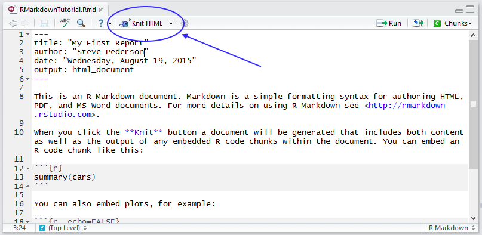
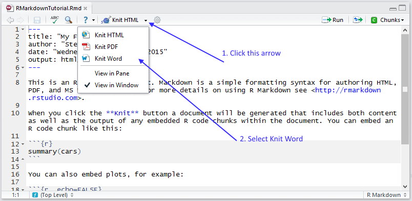

```{r, loadPackages, echo = FALSE, include = FALSE}
library(knitr)
library(readr)
library(dplyr)
library(stringr)
library(reshape2)
opts_chunk$set(echo = TRUE, include = TRUE, 
               warning = FALSE, message = FALSE, fig.align = "center",
               results = 'hide', fig.show = 'hide')
data <- read_csv("data/comments.csv", comment = "#") %>%
  select(-1)
pcr <- read_csv("data/PCR.csv")
pcr_long <- pcr %>%
  melt(id.vars = "Gene",
       variable.name = "CellType", value.name = "Ct") %>%
  mutate(TimePoint = str_extract(CellType, "(0hr|12hr|24hr)"),
         CellType = str_replace(CellType, "_(0hr|12hr|24hr)", "")) 
```

# R Markdown

## Writing Reports Using `rmarkdown`

* `rmarkdown` is a cohesive way to
    + Load & tidy data 
    + Analyse data, including figures & tables
    + Publish everything in a complete report/analysis
* Everything is one document, with our analysis code embedded with our results

*All sessions for RAdelaide were written this way*

## Writing Reports Using `rmarkdown`

We can output our analysis directly as

* HTML
* MS Word Documents
* PDF Documents 
* Slidy or `ioslides` presentations

We never need to use MS Word, Excel or Powerpoint again!

## Writing Reports Using `rmarkdown`

- `.Rmd` files allow us to include normal text alongside embedded `R` code.
    + Create all of our figures & tables directly from the raw data,
    + Data, experimental and analytic descriptions
    + Mathematical/Statistical equations
    + Nicely Formatted Results
    + Any other information


## Creating an *R* Markdown document

Let's create our first `rmarkdown` document

1. Go to the `File` drop-down menu in RStudio
2. New File -> R Markdown...


## The New R Markdown Form

```{r, echo=FALSE, out.width = 534, fig.align = "center", results='asis'}
include_graphics("images/NewRMarkdown.png")
```


## The New R Markdown Form

1. Change the Title to: My First Report
2. Change the Author to your own name
3. Leave everything else as it is & hit OK
4. Save the file as `RMarkdownTutorial.Rmd`

## The R Markdown Format | The Header
 
* The header section is contained between the `---` lines
    + __Nothing can be placed before this!__
    + Uses YAML (**Y**AML **A**in't **M**arkup **L**anguage)
    + Editing is beyond the scope of this course
    + Can set custom `.css` files, load LaTeX packages etc
    
## The R Markdown Format | Code Chunks
    
* Lines 8 -- 10 are a code `chunk`
    + Chunks always begin with ```{r}
    + Chunks always end with ```
    + The code goes between these two delineators
    + Chunk names are optional and directly follow the `r`
    + Other parameters are set here, e.g. do we show/hide the code

## The R Markdown Format | File Structure

* Line 12 is a Section Heading, starting with ##
    + Click the _staggered text_ symbol in the top-right to open the _document outline_
    + Chunk names are shown in _italics_
    + Section Names in plain text
    + Can resize the document outline window

## The R Markdown Format | Text Formatting

`Help > Markdown Quick Reference`

- This describes the text formatting options: 
    + Bold is indicated by \*\*Knit\*\* (or \_\_Knit\_\_)
    + Italics can be indicated using a single asterisk/underline: \*Italics\* or \_Italics\_


    
## The R Markdown Format | Creating the Report

- The default format is an `html_document` & we can change this later.
- Generate the deafault document by clicking `Knit HTML`

```{r, echo=FALSE, fig.show='asis', out.width = 800, results='asis', fig.align = "center"}

```


## The R Markdown Format | Creating the Report

A preview window will appear with the compiled report

- Note the hyperlink to the RMarkdown website & the bold typeface for the word **Knit**
- The *R* code and the results are printed for the line `summary(cars)`
- The plot of `temperature` Vs. `pressure` has been embedded
- The code generating the plot was hidden using `echo = FALSE`

    
## The R Markdown Format | Creating the Report

We could also save this as an MS Word document (i.e. `.docx` format)

```{r, echo=FALSE, fig.show='asis', out.width = 800, fig.align = "center", results='asis'}

```

## The R Markdown Format | Creating the Report

By default, this will be Read-Only

Saving as a `.PDF` may require an installation of LaTeX.

# Making our own report

## Making our own report

Now we can modify the code to create our own analysis.

- Delete everything in your R Markdown file EXCEPT the header

- We'll analyse the `ToothGrowth` dataset we saw earlier

- First we'll need to describe the data

```{r, eval=FALSE}
?ToothGrowth
```

## Describing the data

## Rename the report
First we should change the title of the report to something suitable, e.g. *The Effects of Vitamin C Delivery Methods on Tooth Growth*

## Create a ``Data Description" Section
Now let's add a section header for our analysis to start the report

1. Type `# Data Description` after the header and leaving a line
\newline 
2. Use your own words to describe the data

## Describing the data

## My text was:
We are interested in the effects of Vitamin C on tooth growth, and for this experiment we used Guinea Pigs as the model organism.
We gave guinea pigs Vitamin C supplements at three doses (0.5, 1 and 2*mg*) using two delivery methods.
Delivery method 1 was orange juice, whilst delivery method 2 was ascorbic acid.
Each treatment combination was given to 10 guinea pigs, giving a total sample size of 60.

The measured response was the length of odontoblasts.


## Describing the data
Hopefully you mentioned that there were 10 guinea pigs in each group, with a total of 60.

## Question
Can we get that information from the data itself?

## Describing the data
Hopefully you mentioned that there were 10 guinea pigs in each group, with a total of 60.

## Question
Can we get that information from the data itself? **Yes**

## Solution
`nrow(ToothGrowth)` would give the total number of samples

## Describing the data
We can actually embed this in our data description!

1. Instead of the number 60 in your description, enter: 
\begin{center}
$^\backprime$ \texttt{r nrow(ToothGrowth)} $^\backprime$
\end{center}
2. Recompile the HTML document.
\newline
3. Try to repeat for the number 10

## Adding some *R* code
After our description, we could have a look at the data in a summary

```{r, eval=FALSE}
ToothGrowth %>% 
  group_by(supp, dose) %>% 
  summarise(Count = n()) 
```

We  need to add a code chunk before this to load the package `dplyr`

## Loading *R* packages

1. Before the Data Description header, add a new header called `Required Packages`
\newline
2. Create a code chunk with the contents `library(dplyr)`.
*Hint: You can create an empty code chunk using* `Ctrl+Alt+I`
\newline
3. Recompile the HTML

Adding this has loaded the package `dplyr` so that any code chunks following will be able to use the functions in the package

## Tidying our output
Notice that loading `dplyr` gave us an overly informative message.

We can turn this off to make the report look nicer

1. After the `r` inside the brackets at the start of the code chunk, add a comma
\newline
2. Start typing the word `message` and use the auto-complete feature to set `message = FALSE`
\newline
3. Recompile

## Add the data summary

```{r, echo=FALSE, message=FALSE}
library(dplyr)
```

```{r}
ToothGrowth %>% 
  group_by(supp, dose) %>% 
  summarise(Count = n()) 
```

## Add a plot of the data

We can use `ggplot2` for this

1. Load this package back in the **Required Packages** section
\newline
2. Create a plot using `geom_point()`
\newline
3. Colour the points based on the `supp` variable
\newline
4. Facet the plot based on the `supp` variable


## Add a plot of the data

```{r, echo=FALSE}
library(ggplot2)
```


```{r, echo =FALSE, fig.align='center', fig.height=3, fig.width=4.5}
ggplot(ToothGrowth, aes(x = dose, y = len, colour = supp)) +
  geom_point() +
  facet_grid(~supp) + 
  labs(x = "Dose (mg)", y = "Odontoblast Length (mm)")
```

## Analyse the data

One way to analyse this data would be to conduct a $t$-test at each dosage level

1. Create a new section called `Analysis`
2. Create a lower level heading called `Dosage == 0.5`. \newline (This can be done using 2 or 3 hashes)
3. Create a code chunk with the following code
\begin{center}
\scriptsize
\texttt{(lowDosage <- t.test(len\~{}supp, subset(ToothGrowth, dose==0.5)))}
\end{center}


## Analyse the data

## Questions
1. Why would we store the results as an *R* object?
2. What do the round brackets at the start & end of the code do?

## Analyse the data

1. Repeat the above for the medium and high dosage levels
2. Write some kind of conclusion based on the above results
3. To embed the $p$-values directly in our text, we can call the *R* objects we've created via the embedded code procedure \newline ^$\backprime$^r `embedded code`^$\backprime$^

## Hints
1. The $p$-values can be accessed via `lowDosage$p.value`
2. We may also like to restrict the number of decimal places using the command `round()`

## If we have time

We could provide an even more informative output by plotting confidence intervals

1. Create a new subsection called `Confidence Intervals`
2. Create a `data.frame` with variables `dose`, `diff`, `lower` & `upper` filling with values from the *R* objects we've already created
3. Plot these intervals using`geom_point` and `geom_errorbar`

## Hints
1. The estimates of the mean tooth growth will be in the *R* objects in a component called `$estimate`
2. The lower and upper bounds for the 95\% confidence interval will be in the component called `$conf.int`

## Finishing the analysis

After you're happy with the way your analysis looks

- A good habit is to finish with a section called `Session Info`
- Add a code chunk which calls the *R* command `sessionInfo()`

## Finishing the analysis

So far we've been compiling everything as HTML, but let's switch to an MS Word document

We could email this to our supervisors, or upload to Google docs for collaborators...

## Summary

This basic process is incredibly useful

- We never need to cut & paste anything between document formats
- Every piece of information comes directly from our *R* analysis
- We can very easily incorporate new data as it arrives
- Creates *reproducible research*

