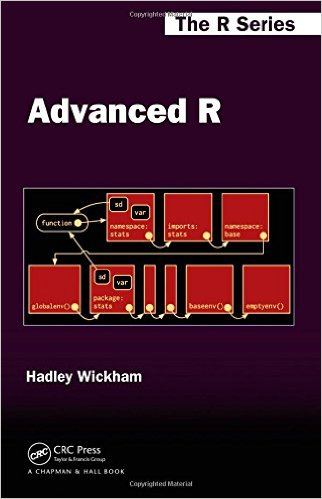
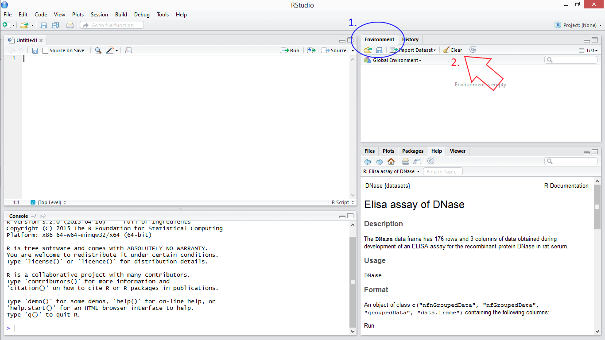

# R Objects & Data Types
Steve Pederson  
21 July 2016  


## Welcome To Day 2

Today's Topics:

1. __`R` Objects & Data Types__
2. Writing Functions in `R`
3. Digging Deeper in `R`
4. Running RStudio In The Cloud


# `R` Objects



## Advanced R

- Much of today's material is from *Advanced R* by Hadley Wickham, Chief Scientist at RStudio
- The online version  is freely available at [http://adv-r.had.co.nz/](http://adv-r.had.co.nz/)
- Can also be physically purchased from Amazon


## Before we start




## Before we start

1. Create a new script:  
    + `File > New File > R Script`
2. Enter the below in the new script 
3. Send to the Console


```r
wd <- "Day_2"
setwd(wd)
```

## Before we start


```r
wd <- "Day_2"
setwd(wd)
```

- We have just done three important steps:
    1. Emptied the `Global Environment` 
    2. Created a new `R` object called `wd` 
    3. Called a function `setwd()`

__Where is the `R` object `wd`?__

__What the the function `setwd()` do?__

## `R` Objects

Main data type so far has been a `data.frame`

- Each column has the same type of data, e.g. numeric, character etc.
- The columns can be different types to each other
- In `R` each column is a `vector`

The key building blocks for `R` objects: **Vectors**

# Vectors

## Vectors

- There is no such thing as a *scalar* in `R`
- Everything is based around the concept of a *vector*
- What is a *vector*?

## Vectors | Definition

A vector is one or more values of the **same type**

## Vectors | Examples

A simple vector would be

```
##  [1]  1  2  3  4  5  6  7  8  9 10
```

__What type of values are in this vector?__

## Vectors | Examples

Another vector might be

```
## [1] "a"     "cat"   "video"
```

__What type of values are in this vector?__

## Vectors | Examples

What about this vector?


```
## [1] "742"       "Evergreen" "Tce"
```

__What type of values are in this vector?__

## The 4 Atomic Vector Types

- *Atomic Vectors* are the building blocks for everything in `R`
- There are four main types

## The 4 Atomic Vector Types | Logical Vectors

1. **logical**

Can only hold the values `TRUE` or `FALSE`


```r
logi_vec <- c(TRUE, TRUE, FALSE)
print(logi_vec)
```

```
## [1]  TRUE  TRUE FALSE
```


## The 4 Atomic Vector Types | Integer Vectors

1. logical
2. **integer**

Useful for counts, ranks or indexing positions (e.g. column 3; nucleotide 254731)


```r
int_vec <- 1:5
print(int_vec)
```

```
## [1] 1 2 3 4 5
```


## The 4 Atomic Vector Types | Double (i.e. Double Precision) Vectors

1. logical
2. integer
3. **double**

Often (& *lazily*) referred to as numeric


```r
dbl_vec <- c(0.618, 1.414, 2)
print(dbl_vec)
```

```
## [1] 0.618 1.414 2.000
```

## The 4 Atomic Vector Types | Character Vectors

1. integer
2. logical
3. double
4. **character**


```r
char_vec <- c("blue", "red", "green")
print(char_vec)
```

```
## [1] "blue"  "red"   "green"
```

## The 4 Atomic Vector Types

These are the basic building blocks for all `R` objects

1. logical
2. integer
3. double
4. character

- Many other vector types built on these
- There are two more rare types we'll ignore: `complex` & `raw`


## Properties of a vector

What defining properties might a vector have?

There are four...

## Properties of a vector

What defining properties might a vector have?

1. The actual *values*
2. *Length*, accessed by the function `length()`
3. The *type*, accessed by the function `typeof()`
    + Similar but preferable to `class()`
4. Any optional & additional *attributes* such as names, etc.; `attributes()`

## Properties of a vector

__Let's try them on our vectors__


```r
typeof(char_vec)
length(int_vec)
attributes(logi_vec)
class(dbl_vec)
typeof(dbl_vec)
```

__Were you surprised by the results?__

## Working with Vectors

We can *combine* two vectors in `R`, using the function `c()`


```r
c(1, 2)
```

```
## [1] 1 2
```

- The numbers `1` & `2` were both vectors with `length()` = 1

- We have combined two vectors of length 1, to make a vector of length 2

## Working with Vectors

__What would happen if we combined two vectors of different types?__

Let's try & see what happens:


```r
new_vec <- c(logi_vec, int_vec)
print(new_vec)
typeof(new_vec)
```

__Q: What happened to the `logical` values?__

## Working with Vectors

__What would happen if we combined two vectors of different types?__

Let's try & see what happens:


```r
new_vec <- c(logi_vec, int_vec)
print(new_vec)
typeof(new_vec)
```

__Q: What happened to the `logical` values?__

Answer: `R` will coerce them into a common type (i.e. integers).

## Coersion

### Discussion Questions
1. What other types could logical vectors be coerced into?
2. Can character vectors be coerced into numeric vectors?
3. Can numeric vectors be coerced into logical vectors?

Try using the functions:  
`as.integer()`, `as.logical()`, `as.double()` & `as.character()`

## Coersion

__What about character vectors?__


```r
simp_vec <- c(742, "Evergreen", "Terrace")
as.numeric(simp_vec)
```

```
## [1] 742  NA  NA
```

# Subsetting Vectors

## Subsetting Vectors

The elements of a vector can be called using `[]`


```r
y <- c("A", "B", "C", "D", "E")
y[2]
```

```
## [1] "B"
```

```r
y[c(1, 3)]
```

```
## [1] "A" "C"
```

## Subsetting Vectors

Double brackets (`[[]]`) can be used to return __single elements__ only


```r
y[[2]]
```

```
## [1] "B"
```

If you tried `y[[c(1,3)]]` you would receive an error message

## Subsetting Vectors

If a vector has name attributes, we can call values by name


```r
euro[1:5]
```

```
##       ATS       BEF       DEM       ESP       FIM 
##  13.76030  40.33990   1.95583 166.38600   5.94573
```

```r
euro[c("ATS", "BEF")]
```

```
##     ATS     BEF 
## 13.7603 40.3399
```

## Subsetting Vectors

*Try repeating the* call-by-name *approach using double brackets*


```r
euro["ATS"]
euro[["ATS"]]
```

__What was the difference in the output?__

## Subsetting Vectors

*Try repeating the* call-by-name *approach using double brackets*


```r
euro["ATS"]
euro[["ATS"]]
```

__What was the difference in the output?__

1. Using `[]` returned the vector with the identical structure
2. Using `[[]]` removed the `attributes` & just gave the value

## Subsetting Vectors | Discussion Question

__Is it better to call by position, or by name?__

Things to consider:

- Which is easier to read?
- Which is more robust to undocumented changes in an object?

## Vector Operations

`R` Functions are designed to work on vectors


```r
dbl_vec - 1
dbl_vec > 1
dbl_vec^2
mean(dbl_vec)
sd(dbl_vec)
sqrt(int_vec)
```

This is one of the real strengths of `R`

## Vector Operations

We can combine the above logical test and subsetting


```r
dbl_vec
```

```
## [1] 0.618 1.414 2.000
```

```r
dbl_vec > 1
```

```
## [1] FALSE  TRUE  TRUE
```

```r
dbl_vec[dbl_vec > 1]
```

```
## [1] 1.414 2.000
```


## Vector Operations

An additional logical test: `%in%`  
(read as: "*is in*")


```r
dbl_vec %in% int_vec
```

```
## [1] FALSE FALSE  TRUE
```

Returns `TRUE/FALSE` for each value in `dbl_vec` if it **is in** `int_vec`

NB: `int_vec` was coerced silently to a `double` vector

# Matrices

## Matrices

- Vectors are strictly one dimensional and have a `length` attribute.
- A `matrix` is the two dimensional equivalent


```r
int_mat <- matrix(1:6, ncol=2)
print(int_mat)
```

```
##      [,1] [,2]
## [1,]    1    4
## [2,]    2    5
## [3,]    3    6
```

## Matrices

- Matrices can only hold __one__ type of value 
    + i.e. logical, integer, double, character
- Have additional attributes such as `dim()`, `nrow()` `ncol()`
- Can have __optional__ `rownames()` & `colnames()`

## Matrices

__Some commands to try:__


```r
dim(int_mat)
nrow(int_mat)
typeof(int_mat)
class(int_mat)
attributes(int_mat)
colnames(int_mat)
length(int_mat)
```

__Ask questions if anything is confusing__

## Matrices

- Use square brackets to extract values by row & column
- The form is `x[row, col]` 
- Leaving either `row` or `col` blank selects the entire row/column


```r
int_mat[2, 2]
int_mat[1,]
```

__How would we just get the first column?__

## Matrices

__NB: Forgetting the comma when subsetting will treat the matrix as a single vector spread down the columns__


```r
int_mat
```

```
##      [,1] [,2]
## [1,]    1    4
## [2,]    2    5
## [3,]    3    6
```

```r
int_mat[5]
```

```
## [1] 5
```

## Arrays

Arrays extend matrices to 3 or more dimensions

Beyond the scope of today, but we just have more commas in the square brackets, e.g.

```r
dim(iris3)
```

```
## [1] 50  4  3
```


```r
dimnames(iris3)
```

## Homogeneous Data Types

__Vectors, Matrices & Arrays are the basic *homogeneous* data types of `R`__

# Heterogeneous Data Types

## Heterogeneous Data Types

Summary of main data types in `R`

Dimension   | Homogeneous | Heterogeneous
------------|-------------|--------------
1d          | `vector`    | `list`       
2d          | `matrix`    | `data.frame`
3d+         | `array`     |

## Lists

A `list` is a __heterogeneous__ vector.

- Each component is an `R` object type
- Can be a `vector`, or `matrix`
- Could be another `list`
- Any other `R` object type we haven't seen yet

## Lists

Many `R` functions provide output as a list


```r
testResults <- t.test(dbl_vec)
typeof(testResults)
testResults
```

NB: There is a function (`print.htest()`) that tells `R` how to print the results to the Console

## Lists

Explore the various attributes of the object `testResults`


```r
attributes(testResults)
length(testResults)
names(testResults)
typeof(testResults)
```


## Lists

We can call the individual components of a list using the `$` symbol followed by the name


```r
testResults$statistic
testResults$conf.int
testResults$method
```

Note that each component is quite different to the others.

## Subsetting Lists

A `list` is a `vector` so we can also subset using the `[]` method


```r
testResults[1]
typeof(testResults[1])
```

Using single square brackets returns a `list` with the structure intact

## Subsetting Lists

Double brackets again retrieve a single element of the vector

- Returns the actual component as the underlying `R` object


```r
testResults[[1]]
typeof(testResults[[1]])
```

*When would we use either method?*

## Lists

- Note also the **Environment** Tab in the top right of RStudio
- Click the arrow next to `testResults` to expand the entry
- This is the output of `str(testResults)`

# Data Frames

## Data Frames

Finally!

- These are the *most common type of data* you will see
- Each column is a vector
- Columns can be different types of vectors


## Data Frames

- Analogous to matrices, but are specifically for *heterogeneous* data
- Have many of the same attributes as matrices
    + `dim()`, `nrow()`, `ncol()`, `rownames()`, `colnames()`
- `colnames()` & `rownames()` are **NOT** optional & are assigned by default

## Data Frames

Here's an example `data.frame` from the package *datasets*

Use `?ToothGrowth` to find out what's in the object


```r
head(ToothGrowth)
```

```
##    len supp dose
## 1  4.2   VC  0.5
## 2 11.5   VC  0.5
## 3  7.3   VC  0.5
## 4  5.8   VC  0.5
## 5  6.4   VC  0.5
## 6 10.0   VC  0.5
```

## Data Frames

__Try these commands__


```r
colnames(ToothGrowth)
dim(ToothGrowth)
nrow(ToothGrowth)
```

## Data Frames

Individual entries can also be extracted using the square brackets, as for matrices


```r
ToothGrowth[1:2, 1]
```

```
## [1]  4.2 11.5
```

We can also refer to columns by name (same as matrices)


```r
ToothGrowth[1:2, "len"]
```

```
## [1]  4.2 11.5
```


## Data Frames

The concept of columns being distinct vectors is quite important & useful

- We can call each column vector of a `data.frame` using the `$` operator


```r
ToothGrowth$len[1:2]
```

**This does NOT work for rows!!!**

## Data Frames

- `R` is *column major* by default (as is `FORTRAN` & Matlab)
- Many other languages are *row major*, e.g. C/C++, Python
- `R` was designed for statistical analysis, but has developed capabilities **far beyond this**

We will see this advantage this afternoon

# Data Frames & Lists

## Data Frames & Lists

__Data frames are actually special cases of lists__

- Each column of a `data.frame` is a component of a `list`
- The components must all be vectors of the same length
- Data Frames can be treated identically to a `list`
- Have additional subsetting operations and attributes

## Data Frames & Lists

Forgetting the comma, now gives a completely different result to a matrix!


```r
ToothGrowth[1]
```

__Was that what you expected?__

__Try using the double bracket method__


# Working With `R` Objects

## Vectors | Name Attributes

__How do we assign names?__


```r
named_vec <- c(a = 1, b = 2, c = 3)
```

OR we can name an existing vector


```r
names(int_vec) <- c("a", "b", "c", "d", "e")
```

## Vectors | Name Attributes

__Can we remove names?__

The `NULL`, or empty, vector in `R` is created using `c()`


```r
null_vec <- c()
length(null_vec)
```

We can use this to remove names


```r
names(named_vec) <- c()
```

*Don't forget to put the names back...*

## Matrices

We can convert vectors to matrices, as earlier


```r
int_mat <- matrix(1:6, ncol=2)
```

`R` is column major so fills columns by default


```r
row_mat <- matrix(1:6, ncol=2, byrow =TRUE)
```

## Matrices | Name Attributes

We can assign row names & column names after creation


```r
colnames(row_mat) <- c("odds", "evens")
```

Or using `dimnames()`


```r
dimnames(row_mat)
```

This a list of `length` 2 with `rownames` then `colnames` as the components.

## Matrices | A word of caution


```r
rec_mat <- matrix(int_vec, ncol = 2)
```

__What has happened here?__

__This is a major criticism made of R__

## Lists


```r
my_list <- list(int_vec, dbl_vec)
names(my_list) <- c("integers", "doubles")
```
OR


```r
my_list <- list(integers = int_vec, doubles = dbl_vec)
```

## Lists

__What happens if we try this?__


```r
my_list$logical <- logi_vec
```

## Lists
We can coerce vectors to lists as well

```r
int_list <- as.list(named_vec)
```

## Data Frames

This is exactly the same as creating lists, but

__The `names` attribute will also be the `colnames()`__


```r
my_df <- data.frame(doubles = dbl_vec, logical = logi_vec)
names(my_df) == colnames(my_df)
```

```
## [1] TRUE TRUE
```

## Data Frames

__What happens if we try to add components that aren't the same length?__


```r
my_df <- data.frame(integers = int_vec,
                    doubles = dbl_vec, logical = logi_vec)
```

## Morning Tea


<div class="footer" style="text-align:center;width:25%">
[Home](http://uofabioinformaticshub.github.io/RAdelaide-July-2016/)
</div>
