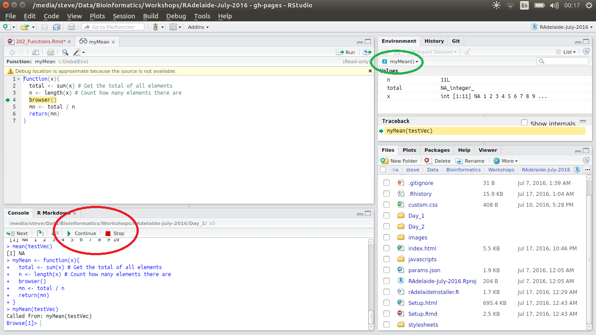

```{r, loadPackages, echo = FALSE, include = FALSE}
library(knitr)
opts_chunk$set(echo = TRUE, include = TRUE, 
               warning = FALSE, message = FALSE, 
               out.width = 800, fig.align = "center")
```

# Functions

## Why write functions?

- Repetitive processes

- Nothing may exist for our purpose

- We can customise existing function
    + We may need to tweak the output of a function
    + We may only need part of a larger function
    + We can customise for increased speed


## The Basics of a Function

A function has three main parts

1. The `formals()` - The _arguments_ supplied to a function
2. The `body()` - This is the _code_ inside the function
3. The `environment()` - Where the function was created

## The Basics of a Function | formals()

```{r}
formals(sd)
```

## The Basics of a Function | body()

```{r}
body(sd)
```

## The Basics of a Function | environment()

```{r}
environment(sd)
```

This is telling us that `sd()` comes from the packages `stats`

## The Basics of a Function

```{r}
f <- function(x) {
  x + 1
  }
```

__What would the `formals()` be?__

__What would the `body()` be?__

__What would the `environment()` be?__

## The Basics of a Function

Let's use our function

```{r}
f(1:5)
```


## Lexical Scoping

__Where does the function look for it's values?__

```{r}
x <- 3
f <- function(x) {
  x + 1
  }
```

__What would we expect to see if we don't provide `x`?__

```{r, error=TRUE}
f()
```


## Lexical Scoping

__Where does the function look for it's values?__

```{r}
x <- 3
f <- function(y) {
  x + 1
  }
```

__Now what would we expect to see if we don't provide `y`?__

```{r}
f()
```

## Lexical Scoping

- If an object in the function is declared as an argument:  
$\implies$ The function looks inside the function call
- If an object in the function is NOT declared as an argument:  
$\implies$ The function looks inside the function, then  
$\implies$ looks in the `Environment` one level up.

# Writing Our Own Functions

## Our First Function

Place the following in a new script called `myMean.R`

```{r}
myMean <- function(x){
  total <- sum(x)
  n <- length(x)
  mn <- total / n
  return(mn)
}
```

Select all, and hit `Ctrl + Enter` to send it to your `Environment`

__What are the `formals()`?__

## Our First Function

Let's call our function

```{r}
testVec <- 1:10
myMean(testVec)
```

- Note that we didn't have to enter `x = testVec` when we called the function
- We could have just used `mn` as the last line

## Our First Function | Writing For Idiots

__What if an idiot called our function?__

- In 6 months, I'll have no idea why I wrote any function
- What problems might arise?
- How can we idiot-proof this function?

## Our First Function | Writing For Idiots

__What if an idiot called our function?__

1. We could comment our code
2. We could think like an idiot
    - Introduce checking steps
    - Deal with any problems we can think of
    
## Our First Function | Writing For Idiots

Add some comments

```{r}
myMean <- function(x){
  total <- sum(x) # Get the total of all elements
  n <- length(x) # Count how many elements there are
  mn <- total / n # Calculate the mean
  return(mn)
}
```

__NB: The comments are not reproduced by `body(myMean)`__

## Our First Function | Writing For Idiots

__What might I do in 6 months which is not intelligent?__

## Our First Function | Writing For Idiots

__What might I do in 6 months which is not intelligent?__

The biggest issue will be missing values.

## Our First Function | Debugging

Let's create a vector with missing values

```{r}
testVec <- c(NA, 1:10)
myMean(testVec)
```

__How can we figure out where the problem is?__

## Our First Function | Debugging

Let's create a vector with missing values

```{r}
testVec <- c(NA, 1:10)
myMean(testVec)
```

We can use the command `browser()` to stop the function, and look inside it's `Environment`

## Our First Function | Debugging

1. Add the extra line to your code
2. Make sure you send it to your `Environment`

```{r}
myMean <- function(x){
  total <- sum(x) # Get the total of all elements
  n <- length(x) # Count how many elements there are
  browser()
  mn <- total / n # Calculate the mean
  return(mn)
}
```

## Our First Function | Debugging

The next time we call the function:

- It will stop when it hits `browser()`
- A new Window will open in your `Script Window`

---

```{r, echo=FALSE, out.width=830}

```

## Our First Function | Debugging

We are now in the internal `Environment` for the function

- The internal objects `total` and `n` are shown in the `Environment` Tab
- Our supplied vector is now called `x`
- We can step through the code using `Ctrl + Enter` (we can't edit this script)
- We exit the `browser` by hitting `Stop` (the red button)

## Our First Function | Debugging

__Where have things gone wrong?__

1. The line `total <- sum(x)` has clearly failed
2. Is `n` the correct value?

## Our First Function | Debugging

__Where have things gone wrong?__

1. The line `total <- sum(x)` has clearly failed
2. Is `n` the correct value?

__How can we remove the `NA` values?__

__CLICK THE STOP BUTTON!!!__

## Our First Function | Debugging

- Let's add an argument: `na.rm`
- We'll give it a default value: `na.rm = TRUE`

## Our First Function | Debugging

```{r}
myMean <- function(x, na.rm = TRUE){
  if (na.rm){
    x <- x[!is.na(x)]
  }
  total <- sum(x) # Get the total of all elements
  n <- length(x) # Count how many elements there are
  browser()
  mn <- total / n # Calculate the mean
  return(mn)
}
```

We only have to specify this if we want `na.rm = FALSE`

## Our First Function | Debugging

Call the function again:

```{r, eval=FALSE}
myMean(testVec)
```

__What did `x[!is.na(x)]` do?__

## Our First Function | Debugging

Now we've protected our future selves, we can remove this line

```{r}
myMean <- function(x, na.rm = TRUE){
  if (na.rm){
    x <- x[!is.na(x)]
  }
  total <- sum(x) # Get the total of all elements
  n <- length(x) # Count how many elements there are
  # browser()
  mn <- total / n # Calculate the mean
  return(mn)
}
```

<div class="footer" style="text-align:center;width:25%">
[Home](http://uofabioinformaticshub.github.io/RAdelaide-July-2016/)
</div>